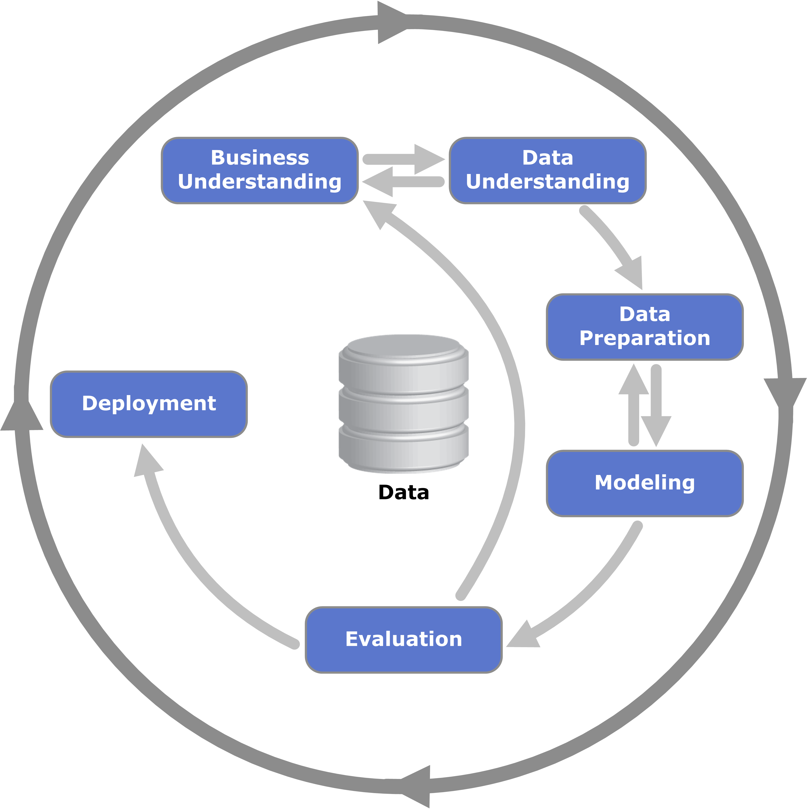

# Reto de "Inteligencia artificial avanzada para la ciencia de datos"

Este proyecto usa la metodología CRISP-DM.

Diagrama: Kenneth Jensen, [CC BY-SA 3.0](https://creativecommons.org/licenses/by-sa/3.0/), vía [Wikimedia Commons](https://commons.wikimedia.org/wiki/File:CRISP-DM_Process_Diagram.png).

## CRISP-DM

| Fase | Reporte | Código |
|---|---|---|
| 1. Business Understanding | [PDF](reports/business-understanding/Business%20Understanding.pdf) | – |
| 2. Data Understanding | – | – |
| 3. Data Preparation | – | – |
| 4. Modeling | – | – |
| 5. Evaluation | – | – |
| 6. Deployment | – | – |

Plan del proyecto: [PVG](https://aipordefinir.github.io/ai-model-tutsipink/)

## Contributors

- A01066843 Facundo Bautista Barbera ([@Facundo-Barbera](https://github.com/Facundo-Barbera))
- A01199004 Oswaldo Isaías Hernández Santes ([@taqueritospro](https://github.com/taqueritospro))
- A01711368 Alfredo Alejandro Soto Herrera ([@AlejandroSH1](https://github.com/AlejandroSH1))
- A01712408 Emiliano Camacho Ponce ([@Emiliano1410](https://github.com/Emiliano1410))
- A01352358 Iker Mejía Hernández ([@ikerMJHDZ09](https://github.com/ikerMJHDZ09))
- A01711783 Jorge Manuel Oyoqui Aguilera ([@JorgeManuelOyoqui](https://github.com/JorgeManuelOyoqui))
