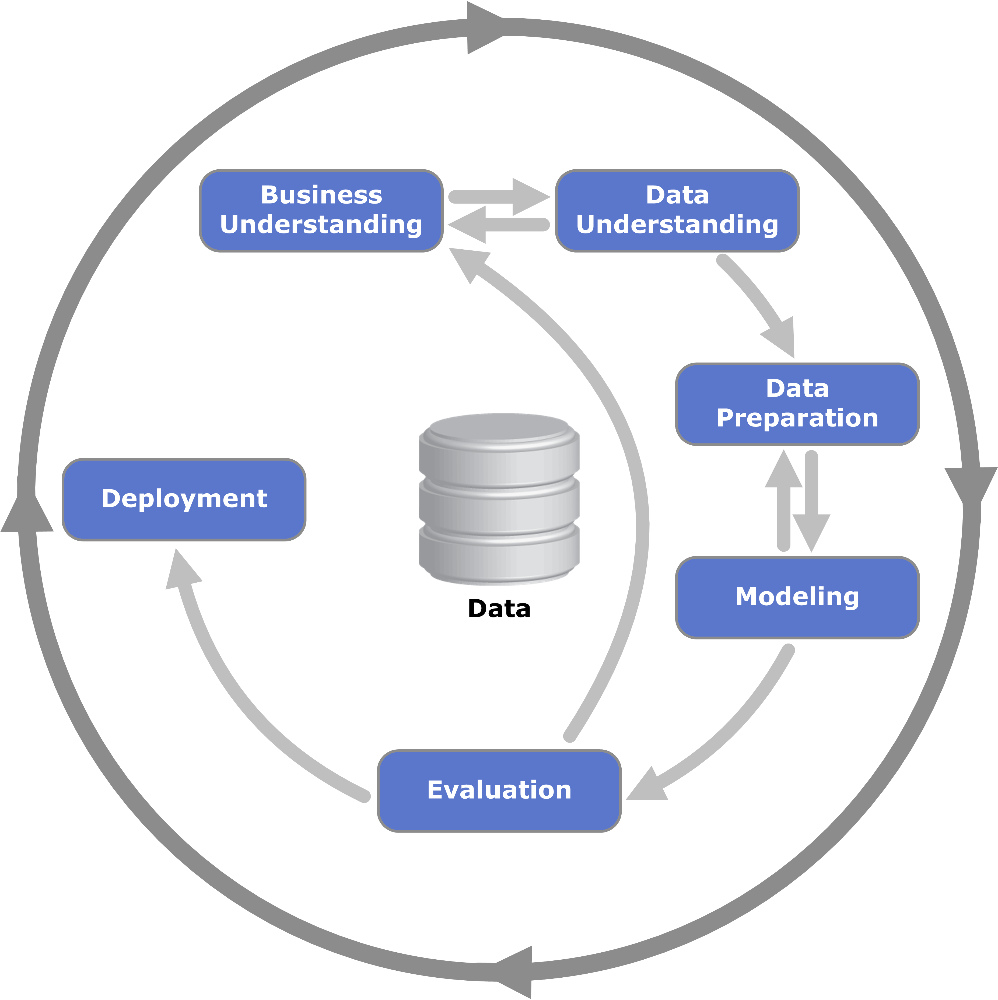

# Reto de la concentración "Inteligencia artificial avanzada para la ciencia de datos"

Este proyecto usa la metodología CRISP-DM.

Diagrama: Kenneth Jensen, [CC BY-SA 3.0](https://creativecommons.org/licenses/by-sa/3.0/), vía [Wikimedia Commons](https://commons.wikimedia.org/wiki/File:CRISP-DM_Process_Diagram.png).

Plan del proyecto: [PVG](https://aipordefinir.github.io/ai-model-tutsipink/)

## CRISP-DM

### 1. Business Understanding

- [Business Understanding 1](reports/01-business-understanding/business-understanding-1/) (7 de octubre)
- [Business Understanding 2](reports/01-business-understanding/business-understanding-2/Business%20Understanding.pdf) (2 de noviembre)
- [Business Understanding 3](reports/01-business-understanding/business-understanding-3/Business%20Understanding.pdf) (12 de noviembre)

### 2. Data Understanding

- [Data Understanding](reports/02-data-understanding/Data%20Understanding.pdf)

### 3. Data Preparation

- [Data Preparation](reports/03-data-preparation/Data%20Preparation.pdf)

### 4. Modeling

Pendiente.

### 5. Evaluation

Pendiente.

### 6. Deployment

Pendiente.

## Contributors

- A01066843 Facundo Bautista Barbera ([@Facundo-Barbera](https://github.com/Facundo-Barbera))
- A01199004 Oswaldo Isaías Hernández Santes ([@taqueritospro](https://github.com/taqueritospro))
- A01711368 Alfredo Alejandro Soto Herrera ([@AlejandroSH1](https://github.com/AlejandroSH1))
- A01712408 Emiliano Camacho Ponce ([@Emiliano1410](https://github.com/Emiliano1410))
- A01352358 Iker Mejía Hernández ([@ikerMJHDZ09](https://github.com/ikerMJHDZ09))
- A01711783 Jorge Manuel Oyoqui Aguilera ([@JorgeManuelOyoqui](https://github.com/JorgeManuelOyoqui))
